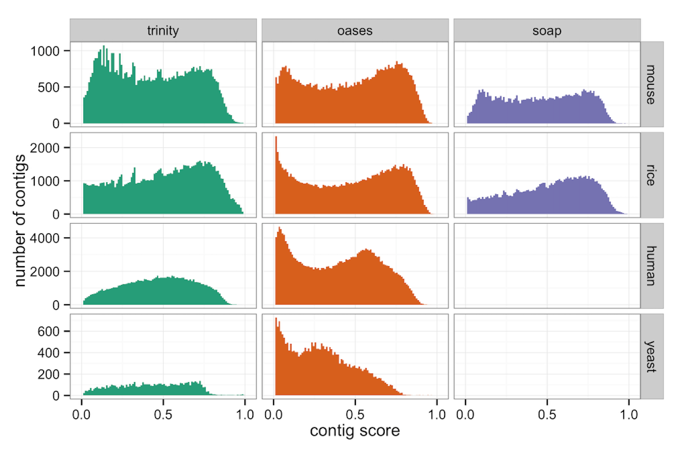

## Results and discussion

### Transrate is software for deep quality analysis of transcriptome assemblies

We have developed Transrate, a method for detailed quality analysis of *de-novo* transcriptome assemblies and their constituent contigs without relying on a reference dataset of any kind. Transrate uses only the contigs themselves and the paired-end reads used to generate them as evidence. In the following sections we present the Transrate method. First we describe the Transrate contig and assembly scores, with a focus on how they can be used to identify misassemblies, select the most useful information from the assembly, and to improve and compare assemblies. Next, we perform experiments using real and simulated data across a range of species to evaluate the accuracy and usefulness of the method, and demonstrate its improvement over existing methods.

![The Transrate workflow. (1.) Transrate takes as input one or more *de-novo* transcriptome assemblies and the paired-end reads used to generate them. (2.) The reads are aligned to the contigs with SNAP, and multi-mapping reads are assigned to their most likely contig of origin with Salmon. (3.) The assigned alignments are examined to measure per-base coverage, per-base edit distance, and the proportion of reads mapping to each contig that agree with the contig structure for each contig. Per-base coverage is analysed to determine segmentation. (4.) Score components are combined to score each contig. (5.) Contig scores are combined with the full set of reads and alignments to score the entire assembly. (6.) Contigs are classified according to whether they are well-assembled, poorly assebled and unfixable, or poorly assembled and potentially fixable by either reassembly, chimera splitting, or targeted scaffolding. ](../figures/figure_1/Transrate_pipeline_figure_long.png)

In transcriptome assembly experiments, the aim is to reconstruct as accurate a representation as possible of the true set of mRNAs present in biological sample. However, due to errors and noise in the sequencing process; incomplete coverage of all transcripts due to low expression or insufficient sequencing depth; and the computational complexity of assembly, an assembly is an imperfect reconstruction. The aim of Transrate is to enable iterative improvements towards a perfect assembly, regardless of the assembly pipeline used, and to quantify confidence in any given assembly or contig. Because the vast majority of transcriptomics experiments currently use Illumina paired-end sequencing, Transrate is focused on data of this type, although the method could be expanded to other types of sequencing.

### The Transrate contig score evaluates confidence in contigs

Transcriptome assemblies tend to contain characteristic errors that result from methodological constraints. Transrate evaluates each contig in an assembly to determine whether it shows any evidence of these errors when compared to the evidence of the aligned reads. A score between 0 and 1 is produced for each contig, estimating confidence that the contig is a perfect assembly of a transcript that was sequenced. The contig score is derived from a descriptive model that captures our definition of a "perfect" contig. This model is fully described in the *methods* section, but we summarise it briefly here: A contig is considered perfect if it represents all the bases in a single source transcript, with the identity and ordering of bases exactly matching the transcript of origin.

One aim of Transrate is to enable researchers to maximise the biological utility of their transcriptome assemblies by selecting out the high-confidence contigs. To this end, Transrate outputs a FASTA file containing the contigs whose score was > 0.5, that is, those contigs that are more likely than not to be well-assembled.

In addition to providing users with the well-assembled contigs for downstream use, the way the contig score is constructed allows identification of specific kinds of misassembly that are potentially recoverable. Transrate outputs a FASTA file for each possible type of error containing contigs that exhibit only that error, as depicted in figure 2:

**Gene family collapse**. Transcripts from different genes in a family, from homeologs, or from gene copies share a high level of sequence identity. The heuristics used by assemblers to avoid incorporating read errors can lead to this true biological information being collapsed, by outputting a single contig from reads that in reality originated from multiple similar transcripts. If groups of such contigs can be separated from the rest of the assembly, they could potentially be reassembled using more relaxed heuristics to achieve a better representation of the source transcripts.

**Chimeras**. Regions of repetitive sequence that are shared between multiple transcripts, especially in the polyA tails or UTRs, can be difficult for assemblers to distinguish from geniune connectivity. It is therefore common to find that a contig contains two or more otherwise well-assembled transcripts that have been concatenated together. If these contigs can be identified, they could potentially be examined and split at the point of concatenation to recover the useful biological information.

**Fragmentation**. Low coverage regions within a sequenced transcript can result from various phenomena including low sequencing depth, low abundance transcripts, and high or low complexity in the original sequence. Whatever the cause, low coverage can lead to incomplete assembly of a transcript, so that the transcript is present in several separate, non-overlapping contigs. Using the pairing of reads, it is common practise to scaffold these fragments. However, in our experience many scaffolded assemblies still contain them. By identifying all the contigs that show evidence of fragmentation, iterative targetted scaffolding could potentially be applied to improve contiguity.

### The Transrate assembly score quantifies assembly quality

Having evaluated all contigs in an assembly, Transrate produces an assembly score, capturing the overall quality of the assembly. This score allows comparison of assemblies from the same set of reads, enabling optimisation of assembly protocols.

When comparing two assemblies from the same reads, there are some situations in which we have a clear intuition about which assembly is better. If we consider two assemblies that each represent the same proportion of the sequenced transcripts, but where the contigs in one assembly tend to be less accurate reconstructions of their source transcripts, the assembly with the more accurate contigs should be preferred. Conversely, of two assemblies that have equally good quality contigs, but where one assembly captures more transcripts, it is the more complete assembly that should be preferred. In summary, a perfect assembly must be accurate and complete, with our confidence in the assembly being proportional to these two features.

The assembly score captures this intuition. The score is the product of two components: (1) the geometric mean of all the contig scores, representing the quality of the contigs that were present, and (2) the proportion of input read pairs that supported the assembly, representing the completeness of the assembly.

### The Transrate score components are independent and classifiable

Key to the contig score, and the classification of contigs, is to capture different types of misassembly. To ensure that the score and its components captured phenomena present in real assemblies, we used Transrate to analyse 10 previously published assemblies from four species as described in *Methods*.

We sought to ensure whether each of the contig score components was contributing useful information. Figure 3a shows that all the components were distributed across the full range (0 to 1) in all assemblies, and that each exhibits enrichment towards the extremes. This suggests again that the components capture real variability present in assemblies, and that the components are useful for classification.

In order to determine whether all the components were necessary, we examined correlation between the components. To avoid giving undue weight to larger assemblies, we sampled 5000 contigs from each assembly. Pearson correlation was calculated between each pair of score components (Figure 3b) demonstrate that the score components are independent, i.e. that each captures unique information compared to the other components.

Next, we examined the distribution of contig scores to establish whether it allowed natural classification of contigs. As shown in figure 4, the contig score showed a bimodal distribution in most assemblies, with enrichment of scores close to the extremes. Some assemblies (rice-soap, human-trinity and human-yeast) did not show bimodal distributions, but were distributed across the range. This indicates that the contig score is capturing real variability between contigs in all the assemblies, and suggests a natural dichotomy between high and low quality contigs in many assemblies.

### The contig score is a highly accurate measure of contig quality

Having established that the contig score meets basic requirements for use as a classifier, we sought to quantify its accuracy using both real and simulated data.

#### Using real data

For each of the four species for which we sourced assemblies from the literature, we downloaded the full set of annotated cDNAs for that species from the Ensembl Genomes v25 release to use as a reference. We aligned the contigs from each assembly to the reference using blastn. Because the *de-novo* assemblies are likely to contain genuine biological novelty, including unannotated transcripts from known genes, transcripts from unannotated genes, and lncRNAs, we considered only the set of contigs that aligned to a reference transcript.

We constructed a reference score that reflects our intuition about a perfect contig. In the reference context, a perfect contig aligns to a transcript so that the entire transcript is covered by the contig, the entire contig is covered by the transcript, and the aligned sequences have perfect sequence identity. We formalised this as a reference score as follows:

$$refscore = qcov * tcov * id$$

We calculated this score for every contig that mapped to a reference transcript in each assembly. We then classified contigs as 'true' or 'false' according to the reference, with refscore >= 0.9 corresponding to 'true', and refscore < 0.9 corresponding to 'false'.

![Accuracy of the reference-free Transrate contig score as compared to a reference-based evaluation. (a) Proportion of contigs in each Transrate score bin that are 'true' according to the reference, for contigs in assemblies generated from real sequencing data. Note that differences between the reference and the truth limit the maximum proportion of 'true' contigs in any bin. (b) As a, but using simulated reads where the ground truth is known. (c) Receiver Operator Characteristic (ROC) curves for assemblies of each species using simulated reads, where the ground truth is known.](../figures/figure_5/figure.png)

As expected, we found that the higher Transrate score deciles tend to contain higher proportions of 'true' contigs when compared to the reference (figure 5a). Across rice, mouse and human there was a very clear positive trend with increasing proportions of true contigs in increasing score deciles. The trend was present but less clear in yeast.

Across all assemblies the maximum proportion of contigs that were 'true' in any decile was 0.7. We hypothesise that this discrepency reflects the incompleteness of the reference annotations.

**note to coauthors: there's a possibility we could compare to RSEM-eval here:**

- in the RSEM-eval paper they focus almost exclusively on the assembly score, not on scoring contigs
- however there is a comment that they calculate a contig_impact_score which measures the contribution each contig made to the assembly score
- I took a look at those scores for some assemblies - they are range between -5000 and +10000000
- We can do a binning analysis of their contig_impact_score and compare it to ours (see example plot in the directory)
- If we do this, we should be sure to include assemblies where there are lots of different kinds of errors, as it would make them look artifically better to select assemblies with only collapse errors

#### Using simulated data

To examine the hypothesis that the ~30% of 'false' contigs in the highest score bins in the analysis based on real data were caused by incomplete reference annotation, we conducted an experiment using simulated reads where we knew the exact set of possible true transcripts that the assembly might reconstruct.

We simulated 4 million read pairs from each species (rice, mouse, human, and yeast) as described in *Methods*, and assembled them using Velvet-Oases with default settings. We then analysed the assemblies using Transrate, and generated reference-based scores for each contig as in the real data analysis.

Score binning analysis on these data (figure 5b) showed that the highest Transrate contig score bins contained close to 100% 'true' contigs when compared to the reference, supporting our hypothesis that incomplete reference caused imperfect correlation in the analysis based on real data.

Because the exact set of possible true assembled sequences was known for the simulated datasets, we extended our analysis to perform a full binary classification accuracy test. Using the 'true'/'false' classification as in the previous analysis, but this time using a naive reference score cutoff as 0.5, we varied the cutoff for classifying contigs using the Transrate contig score from 0.1 to 0.9 and generated receiver operator characteristic curves for each assembly (figure 5c). We also calculated the Matthews correlation coefficient (MCC) for each contig score cutoff. The Transrate score allowed extremely accurate classification of contigs, with an optimal MCC of 0.84, corresponding to a sensitivity of 0.89721695 and specificity of 0.9665546.

**note to coauthors: (this should be extended for the other species - currently just rice for demonstration purposes).**

**note to coauthors: after much thought, I realised it's not valid to compare to RSEM-eval in the ROC analysis, because their contig_impact_score is a relative ranking or impact, not an objective quality score, and has no maximum (that I can discern from their paper or outputs), and so cannot be used for classification.

### The assembly score allows comparison between assemblies

**note to coauthors: I think we should have this section. here's what I think it should contain:**

- from each test species, we take one chromosome and simulate a small set of rnaseq reads from it, say 250,000 pairs

then:

1. we take those reads and do a parameter sweep with 3 different assemblers, say 40 assemblies from each
  - Transrate them all, and also generate reference-based score (geometric mean of the refscores for all contigs as above)
  - show the correlation between change in Transrate assembly score and change in reference-based score
  - at this stage we could include RSEM-eval for comparison
2. take the reference contigs and introduce three kinds of errors at known rates: gene family collapse, chimerism, and fragmentation
  - then Transrate them all and show correlation between Transrate assembly score and the error rate for the different kinds of errors
  - could

### Contig classification leads to assembly improvement

**note to coauthors: I think we should do this analysis**

very simple procedure:

- take the assemblies and throw out the contigs with bad scores, show that the assembly score gets better
- show that there's an optimal cutoff? We've talked about this idea before. We could save this for the transfix paper, but the RSEM-eval paper does show a small amount of data where they throw away contigs that don't contribute much - if we want to do better it might be worth including this idea (simple for us to do)

### Broad analysis of assemblies provides guidance for using the Transrate assembly score

As we have shown, the Transrate contig score is highly accurate at identifying poor quality contigs, and the assembly score incorporates contig quality and assembly completeness. Assemblies with a very low Transrate score must therefore either contain mostly very poor quality contigs (increasing the difficulty and likeihood of error for downstream analysis), or incorporate very little of the read data (reducing the power of downstream analysis), or both.

Noting that, to date, no study has surveyed assembly quality across the literaure, we downloaded and analysed transcriptomes available on the NCBI Transcriptome Shotgun Assembly database (TSA). Assemblies from this database were selected for further analysis only if the following criteria were met:

1. The assembly program was listed
2. The compressed read files were <= 8GB in size
3. Paired-end reads were available for download
4. The final assembly contained at least 5000 contigs

We ran Transrate on the 177 assemblies that met these criteria, and found that the resulting assembly scores ranged from 0.001 to 0.56 (figure 6a). This suggests that there are many assemblies of very poor quality in the wild. The data also suggest that a score of > 0.5 is excellent compared to the quality of assemblies currently being used in the literature. This survey demonstrates the need for accurate quality assessment, and informed assembly improvement strategies.

Some authors (e.g. @martin_next-generation_2011) have suggested that particular clades of organism may present more of a challenge in transcriptome assembly than others. We examined the TSA analysis data segmented by clade at a depth that separated athropods, vertebrates, and vascular plants, to see if there was evidence of worse assembly quality in particular clades. Taking only the clades with >10 assemblies (figure 6b), we found no enrichment of poor-quality assemblies in any clade. Rather, we found that in every clade, a range of assembly qualities was present spanning from extremely poor (~0.001) to relatively good (>0.5).

*note to coauthors: do we need some statistics in here? currently just subjective assessment of the plots*

Novel assembly tools tend to claim superiority over other assemblers when tested using a limited dataset. We used the TSA dataset to see if any assembler consistently produced higher-quality assemblies. Comparing only assemblers with >10 assemblies in the dataset (figure 6c), we found that three of the most popular assemblers (Trinity, Oases, and SOAPdenovo-Trans) produced assemblies of variable quality across the full range of scores present, with no clear advantage of any one assembler. We note that Newbler, Agalma and Trans-Abyss assemblies tended to produce lower scores, but that these assemblies were each from a single study per assembler, limiting the range of scores that might be expected. We therefore refrain from concluding that these assemblers are necessarily worse.

Because contiguity in assembly is related to overlap of the information content in reads, it might be expected that longer reads would reduce the difficult of the assembly process and lead to higher quality assemblies. We segmented the TSA dataset by read length (figure 6d), and found no evidence that increased read length was correlated with higher assembly scores. However, the power of the analysis was limitd by the overrepresentation of reads of length 100 or 101 in the dataset.

### Future work
